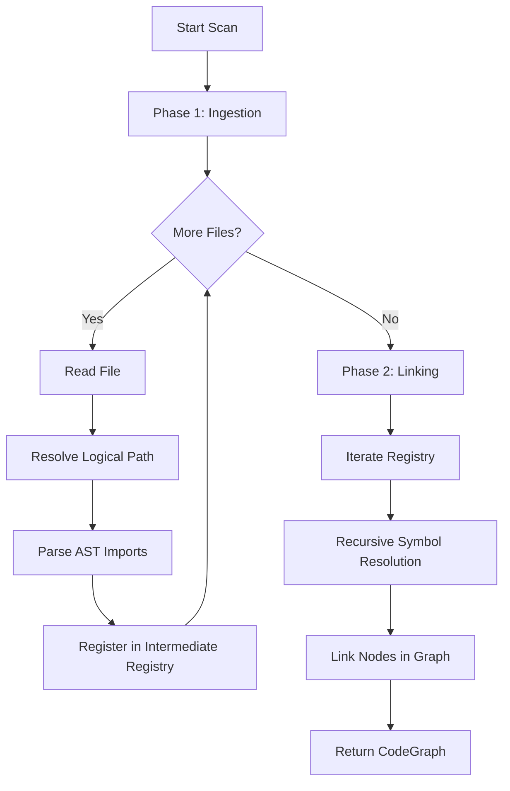

# Detection Bounded Context: Design & Architecture

## 1. Overview
The **Detection Context** is the "Sensory System" of DDDGuard. Its sole responsibility is to bridge the gap between the **Physical World** (Files on Disk) and the **Logical World** (The CodeGraph).

It scans source code, parses syntax (AST), and resolves dependencies to build the initial state of the `CodeGraph`.

**Primary Goal:** Produce a `CodeGraph` where every Python file is a Node, and every `import` statement is a directed Edge.

---

## 2. Public API (Driving Port)

The context exposes a single synchronous entry point via its Facade.

```python
# src/dddguard/scanner/detection/ports/driving/facade.py

def scan_physical_project(self, target_path: Path, scan_all: bool = False) -> CodeGraph:
    ...

## 3. Internal Workflow (The Use Case)
    -   **Input:** Root directory path.
    -   **Output:** CodeGraph Aggregate (Nodes in LINKED status).

The logic is orchestrated by ScanProjectUseCase. It executes in two strict phases to ensure data consistency.


### Phase 1: Ingestion (Discovery)
**Goal:** Create a flat list of all modules and their raw imports without trying to connect them yet.

-   **I/O Abstraction:** `IProjectReader` (FileSystemRepository) streams files safely. It handles binary exclusion, encoding errors, and `.gitignore` rules.
-   **Logical Path Calculation:** `ModuleResolutionService` converts physical paths to Python dot-notation.
    -   `/src/app/main.py` -> `app.main`
    -   `/src/pkg/__init__.py` -> `pkg`
-   **AST Parsing:** `AstImportParserService` scans the content.
    -   It is stateless and blind. It doesn't know if imported modules exist.
    -   It handles relative import math (e.g., `from .. import x` -> determines logical base path).
    -   Produces `ImportedModuleVo` (Raw strings).

### Phase 2: Linking (Graph Assembly)
**Goal:** Connect the dots. Resolve raw strings ("utils") to actual nodes ("src.utils").
This phase uses the Hybrid Resolution Strategy implemented in `RecursiveImportResolverService`.## 4. Resolution Logic (The Core Intelligence)
Python imports are ambiguous. `from pkg import x` can mean:
-   Import module `pkg.x` (Submodule).
-   Import class/var `x` from `pkg/__init__.py`.
-   Import class/var `x` re-exported by `pkg` from somewhere else.

We resolve this ambiguity in the following order:

### A. Submodule Priority
If `pkg.x` exists in our registry as a file, we always link to it directly. This ensures the graph reflects dependency on the implementation file, not just the container package.

### B. Root Normalization
If the project root is named `src`, and code imports `src.utils`, but the registry only has `utils` (logical path), we normalize the import path by stripping the root prefix.

### C. Recursive Re-export Tracing
If we import a name that is NOT a submodule, we check if the parent module re-exports it.
-   **Scenario:** `main.py` -> `from pkg import Service`.
-   **Chain:** `pkg/__init__.py` -> `from .internal import Service`.
-   **Result:** The graph creates a direct link: `main` -> `pkg.internal`.
**Why?** This adheres to the "Truth on the Ground" principle. We want to know where the code actually lives, to correctly map DDD patterns later.

### D. Fallback (Container Linking)
If...

## 5. Key Domain Services
| Service                       | Responsibility                                                                                              | Type         |
| :---------------------------- | :---------------------------------------------------------------------------------------------------------- | :----------- |
| `ModuleResolutionService`     | Path <-> str. Handles `__init__` stripping and relative path calculation.                                   | Static / Pure|
| `AstImportParserService`      | str (code) -> List[`ImportedModuleVo`]. Parses AST. Handles Import vs ImportFrom.                          | Static / Pure|
| `RecursiveImportResolverService`| Traces dependency chains through re-exports. Cycle detection included.                                    | Static / Pure|

## 6. Edge Cases Handled
-   **Relative Imports from Root:** `from .. import x` resolving to empty string base is handled gracefully.
-   **Broken Syntax:** Files with `SyntaxError` are logged but do not crash the scan.
-   **Circular Re-exports:** The recursive resolver tracks visited states to prevent infinite loops.
-   **Binary Files:** Skipped during Phase 1 if they don't look like text, even if extension is `.py`.